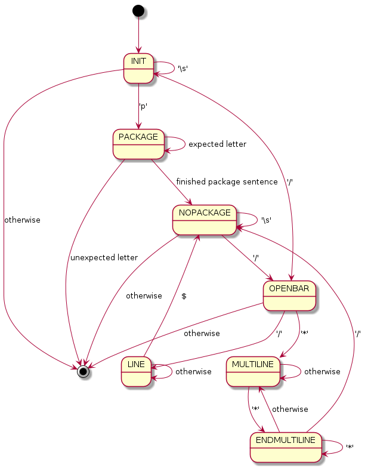

This is my first library in Rust and the main reasons to dev it, in any
order, are:

* get fun

* learn some Rust

* use these utilities in my, currently python, projects

The project aims for simple utilities to process source code

``extract_java_headers()``
==========================

This function receives a String with a java source code and returns it's
headers if any.

It resolves it with the following state diagram:

